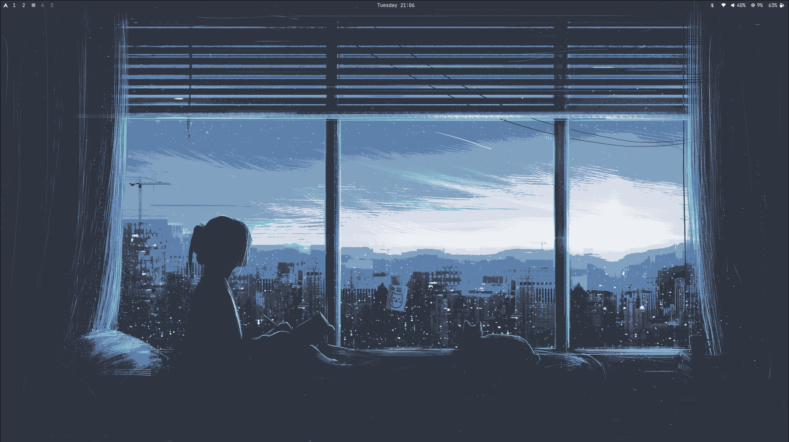
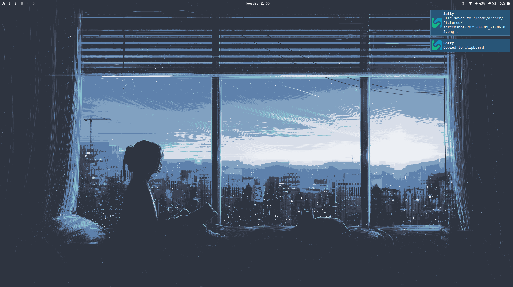
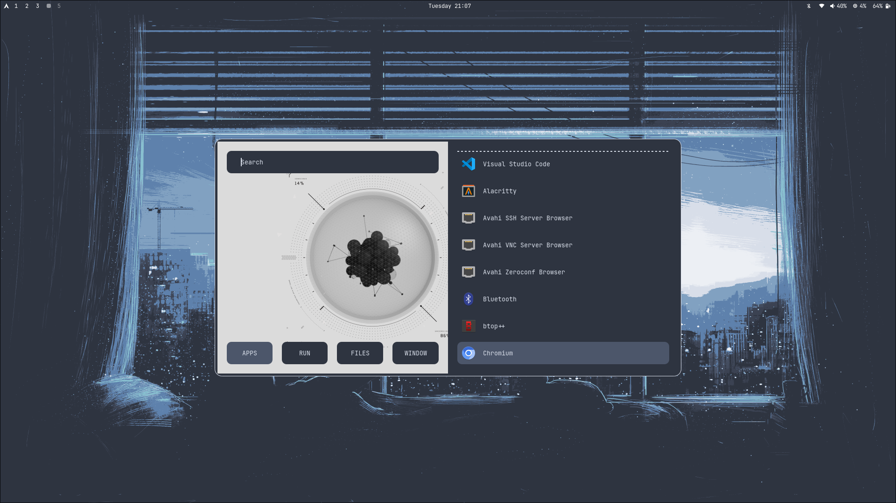
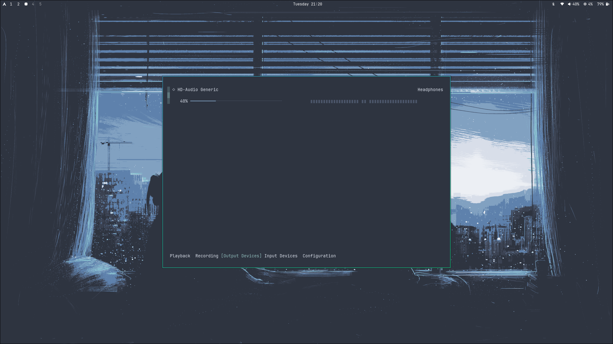

# Nord Hyprland Configuration

A beautiful Nord-themed Hyprland configuration with automatic installation for Arch Linux.

> **Special thanks to [omarchy](https://github.com/basecamp/omarchy) for the inspiration and Nord wallpaper (`omarchy-nord-1.png`) included in this configuration.** ❄️

## 🚀 Quick Installation

```bash
# Clone the repository
git clone https://github.com/TheFreeloader/nord-hyprland-config.git
cd nord-hyprland-config

# Make the install script executable
chmod +x install.sh

# Run the installer (Arch Linux only)
./install.sh
```

## 📋 What's Included

### Configuration Files
- **Hyprland**: Window manager configuration with Nord theming
- **Waybar**: Status bar with Nord colors and custom modules
- **Rofi**: Application launcher with Nord theme
- **Alacritty**: Terminal emulator with Nord colorscheme
- **btop**: System monitor with Nordic theme

### Applications Installed
- **Hyprland**: Wayland compositor
- **Waybar**: Status bar with TUI-focused modules
- **Rofi**: Application launcher
- **Nautilus**: File manager
- **GNOME Text Editor**: Text editor
- **btop**: System monitor with Nordic theme (TUI)
- **Blueberry**: Bluetooth manager GUI
- **Dunst/Mako**: Notification daemons
- **Screenshot tools**: grim + slurp + satty (annotation)
- **Audio controls**: wiremix (TUI), impala (network TUI), pamixer (CLI)
- **System controls**: brightnessctl, playerctl
- **Media viewers**: mpv (video), imv (images), evince (PDF)
- **Archive manager**: file-roller
- **Web browser**: Firefox
- **System info**: neofetch
- **Utilities**: tree, wget, curl, unzip, p7zip

> **📱 TUI-First Approach**: This configuration prioritizes terminal-based (TUI) applications over GUI ones. Clicking Waybar modules opens tools like `wiremix` for audio, `impala` for network, and `btop` for system monitoring in Alacritty terminal windows.

### Themes
- **GTK Theme**: Nordic (dark variant)
- **Icon Theme**: Papirus-Dark with Nordic colors  
- **Cursor Theme**: Nordic cursors
- **Fonts**: JetBrains Mono Nerd Font (already installed)

## 🎯 System Requirements

- **OS**: Arch Linux only
- **Display Manager**: SDDM (will be enabled automatically)
- **Existing packages**: The installer checks for already installed packages and only installs missing ones

## 🛠 What the Installer Does

The minimal installer automatically:

1. **Installs yay**: If not present, builds and installs yay AUR helper
2. **Checks dependencies**: Only installs missing packages from the required list
3. **Backs up configs**: Creates timestamped backup in `~/.config_backup_[date]`
4. **Installs configurations**: Copies all config files to `~/.config/`
5. **Sets up themes**: Installs and configures Graphite Nord theme system-wide
6. **Copies wallpaper**: Sets up Nord wallpaper from `.themes/nord/background/` to `~/Pictures/Wallpapers/`
7. **Enables services**: Starts Bluetooth and enables SDDM
8. **Post-setup**: Creates utility scripts and environment variables

## 🖥️ TUI-First Philosophy

This configuration embraces **Terminal User Interface (TUI)** applications over traditional GUI programs:

- **🎵 Audio Control**: Click Waybar volume → Opens `wiremix` (TUI) in Alacritty
- **🌐 Network Management**: Click Waybar network → Opens `impala` (TUI) in Alacritty  
- **📊 System Monitoring**: Click Waybar CPU → Opens `btop` (TUI) in Alacritty
- **🔧 Quick Actions**: Right-click for instant CLI commands (e.g., `pamixer -t` to mute)

**Why TUI?** Faster, lighter, more keyboard-friendly, and perfectly integrated with the terminal-centric workflow.

## 📦 Packages Installed (if missing)

### Core Components
- hyprland, waybar, rofi
- nautilus (file manager)
- gnome-text-editor, btop, blueberry

### System Tools
- dunst, mako (notifications)
- grim, slurp, satty (screenshots + annotation)
- wl-clipboard (clipboard manager)
- swaybg (wallpaper)

### Network & Bluetooth
- **impala** (TUI network manager - primary interface)
- pulseaudio-bluetooth, bluez-utils (Bluetooth support)

### Audio & Controls (TUI-Focused)
- **wiremix** (TUI audio mixer - primary)
- **impala** (TUI network manager)
- **pamixer** (CLI audio control)
- **pulsemixer** (TUI audio mixer - alternative)
- brightnessctl (brightness control)
- playerctl (media control)

### File Management & Viewers
- nautilus (file manager)
- gvfs, gvfs-mtp (virtual file systems)
- file-roller (archive manager)
- evince (PDF viewer)
- mpv (video player)
- imv (image viewer)

### System Integration
- polkit (privilege escalation)
- xdg-desktop-portal-hyprland (desktop integration)
- qt6-wayland (Qt Wayland support)
- xdg-user-dirs, xdg-utils

### Web & Utilities
- firefox (web browser)
- neofetch (system info)
- tree, wget, curl, unzip, p7zip
- man-db, man-pages

### AUR Helper & Packages
- **yay** (installed automatically if missing)
- hyprpicker (color picker)
- swaylock-effects (screen locker)
- wlogout (logout menu)
- nordic-theme (GTK theme)
- hyprshot (screenshot utility)
- wl-clip-persist (clipboard persistence)
- wlsunset (blue light filter)

## 📁 Directory Structure

```
nord-hyprland-config/
├── install.sh                    # Main installation script
├── scripts/
│   ├── install-dependencies.sh   # Package installation (Arch only)
│   ├── install-configs.sh        # Configuration files
│   ├── install-themes.sh         # Theme installation
│   ├── post-install-setup.sh     # Post-installation setup
│   └── uninstall.sh             # Uninstallation script
├── .config/
│   ├── hypr/                    # Hyprland configuration
│   ├── waybar/                  # Waybar configuration
│   ├── rofi/                    # Rofi configuration
│   ├── alacritty/               # Alacritty configuration
│   └── btop/                    # btop configuration
└── README.md
```

## 🔧 Manual Installation

If you prefer to install components manually:

### Dependencies (Arch Linux)
```bash
# Core system packages (automatically installs yay if needed)
sudo pacman -S --needed hyprland waybar rofi nautilus gnome-text-editor btop blueberry dunst grim slurp satty wl-clipboard swaybg mako pavucontrol brightnessctl playerctl pamixer pulsemixer polkit xdg-desktop-portal-hyprland qt6-wayland networkmanager network-manager-applet pulseaudio-bluetooth bluez-utils gvfs gvfs-mtp file-roller evince firefox mpv imv neofetch tree wget curl unzip p7zip xdg-user-dirs xdg-utils man-db man-pages

# AUR packages (with yay - installed automatically)
yay -S --needed hyprpicker swaylock-effects wlogout nordic-theme hyprshot wl-clip-persist wlsunset
```

### Configuration Files
```bash
# Backup existing configs
cp -r ~/.config ~/.config_backup_$(date +%Y%m%d)

# Copy configurations
cp -r .config/* ~/.config/
```

### Themes
```bash
# Nordic theme should be available via AUR or manually
# Papirus icons should already be installed
```

## 🎨 Customization

### Colors
The Nord color palette is used throughout:
- **nord0**: `#2E3440` (Dark)
- **nord1**: `#3B4252` 
- **nord2**: `#434C5E`
- **nord3**: `#4C566A`
- **nord4**: `#D8DEE9` (Light)
- **nord8**: `#88C0D0` (Blue)
- **nord11**: `#BF616A` (Red)
- **nord13**: `#EBCB8B` (Yellow)
- **nord14**: `#A3BE8C` (Green)

### Wallpapers
The installer automatically copies the Nord wallpaper from `.themes/nord/background/omarchy-nord-1.png` to `~/Pictures/Wallpapers/`. You can add more wallpapers there and use the `change-wallpaper` script:
```bash
change-wallpaper                    # Random wallpaper from ~/Pictures/Wallpapers/
change-wallpaper ~/path/to/image.png # Specific wallpaper
```

### Screenshots
Use the `screenshot` script:
```bash
screenshot full     # Full screen
screenshot area     # Select area
screenshot window   # Active window
```

## 🔄 Updating

To update the configuration:
```bash
cd nord-hyprland-config
git pull
./install.sh
```

## 🗑 Uninstalling

To uninstall the configuration:
```bash
chmod +x scripts/uninstall.sh
./scripts/uninstall.sh
```

The uninstaller offers several options:
1. Full uninstall and restore from backup
2. Remove configs only (keep themes)
3. Remove themes only (keep configs)
4. Remove everything (no restore)

## 📦 Supported Distributions

- **Arch Linux** (Full automatic support)
- **Other distributions** (Manual installation required)

For non-Arch users, please install the dependencies manually and then copy the configuration files.

## 🐛 Troubleshooting

### Common Issues

**Hyprland won't start:**
- Check if your GPU supports Wayland
- Ensure you're not running as root
- Check logs: `journalctl -u hyprland`

**Themes not applying:**
- Log out and log back in
- Run `gsettings set org.gnome.desktop.interface gtk-theme 'Nordic'`
- Check GTK settings in `~/.config/gtk-3.0/settings.ini`

**Missing fonts:**
- Run `fc-cache -fv` to refresh font cache
- Install missing fonts manually

**Audio not working:**
- Check PipeWire status: `systemctl --user status pipewire`
- Restart audio: `systemctl --user restart pipewire`

## 📸 Screenshots

<div align="center">

### Desktop Overview



*Clean Nord-themed desktop with Hyprland window manager and TUI-focused Waybar*

### Application Launcher & TUI Tools




*Rofi launcher, btop system monitor, and wiremix audio mixer - all with Nord theming*

</div>

## ⌨️ Keybindings

All keybindings use **Super (Windows key)** as the main modifier.

### 🚀 Applications
| Key | Action |
|-----|--------|
| `Super + Enter` | Terminal (Alacritty) |
| `Super + Space` | App Launcher (Rofi) |
| `Super + F` | File Manager (Nautilus) |
| `Super + B` | Browser (Chromium) |
| `Super + Shift + Space` | Toggle Waybar |

### 🪟 Window Management
| Key | Action |
|-----|--------|
| `Super + W` | Close active window |
| `Super + V` | Toggle floating mode |
| `Super + J` | Toggle window split |
| `Super + P` | Enable pseudo mode |
| `Super + M` | Exit Hyprland |

### 🔄 Navigation
| Key | Action |
|-----|--------|
| `Super + Arrow Keys` | Move focus between windows |
| `Super + 1-9,0` | Switch to workspace 1-10 |
| `Super + Shift + 1-9,0` | Move window to workspace 1-10 |
| `Super + Tab` | Next workspace |
| `Super + Shift + Tab` | Previous workspace |
| `Super + S` | Toggle scratchpad |
| `Super + Shift + S` | Move window to scratchpad |

### 📷 Screenshots
| Key | Action |
|-----|--------|
| `Print` | Screenshot region |
| `Shift + Print` | Screenshot window |
| `Ctrl + Print` | Screenshot full display |

### 🎵 Media & System
| Key | Action |
|-----|--------|
| `Volume Up/Down` | Adjust volume (5%) |
| `Mute` | Toggle audio mute |
| `Mic Mute` | Toggle microphone mute |
| `Brightness Up/Down` | Adjust screen brightness |
| `Media Next/Prev` | Media player controls |
| `Play/Pause` | Toggle media playback |

### 🖱️ Mouse
| Action | Result |
|--------|--------|
| `Super + Left Click + Drag` | Move window |
| `Super + Right Click + Drag` | Resize window |
| `Super + Scroll` | Switch workspaces |

> **💡 Tip**: TUI applications (wiremix, impala, btop) can be accessed by clicking their respective Waybar modules!

## 🙏 Credits

- **[omarchy](https://github.com/basecamp/omarchy)** - For the beautiful Nord wallpaper (`omarchy-nord-1.png`) and Nord theme inspiration
- **[Nord Project](https://www.nordtheme.com/)** - For the amazing Nord color palette
- **[Hyprland](https://hyprland.org/)** - For the fantastic Wayland compositor
- **[vinceliuice](https://github.com/vinceliuice)** - For the Graphite GTK theme
- **Arch Linux Community** - For maintaining the AUR packages used in this setup

## �📄 License

This configuration is provided as-is for personal use. Individual components may have their own licenses.

## 🤝 Contributing

Feel free to submit issues, feature requests, or pull requests to improve this configuration.

---

**Enjoy your beautiful Nord Hyprland setup! ❄️**
