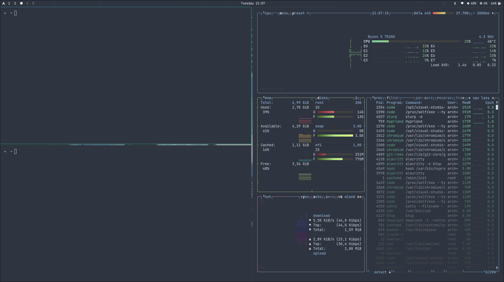

# Nord Hyprland Configuration

A minimal Hyprland setup with automatic installation for Arch Linux.

> **Special thanks to [omarchy](https://github.com/basecamp/omarchy) for the Nord wallpaper.** ❄️

## 🚀 Quick Installation

```bash
git clone https://github.com/TheFreeloader/nord-hyprland-config.git
cd nord-hyprland-config
chmod +x install.sh
./install.sh
```

## 📋 What's Included

### Core Applications
- **Hyprland**: Wayland compositor with Nord theming
- **Waybar**: Status bar with TUI-focused modules  
- **Rofi**: Application launcher with Nord theme
- **Alacritty**: Terminal emulator
- **btop**: System monitor (TUI)
- **wiremix**: Audio mixer (TUI)
- **impala**: Network manager (TUI)

### Essential Tools
- Screenshot suite (grim + slurp + satty)
- Audio controls (pamixer, playerctl)
- File manager (nautilus), media viewers (mpv, imv)
- System utilities & development tools

> **🖥️ TUI-First Philosophy**: Click Waybar modules to open TUI applications in terminal windows - faster, lighter, and more keyboard-friendly.

## � Installation Features

The installer automatically:
1. **Installs missing packages** - Checks existing packages, only installs what's needed
2. **Optimizes mirrors** - Updates to faster package mirrors if needed
3. **Configures everything** - Copies configs, creates directories, sets up utilities
4. **Enables services** - SDDM display manager and essential system services

> **Enhanced Setup**: Modified dependencies and post-install scripts for improved performance and compatibility.

## 📸 Screenshots

<div align="center">

### Desktop Overview


### Application Launcher & TUI Tools




*Nord-themed desktop with TUI-focused workflow*

</div>

## ⌨️ Keyboard Shortcuts

### 🚀 Applications
| Key | Action |
|-----|--------|
| `Super + Enter` | Terminal |
| `Super + Space` | App Launcher |
| `Super + F` | File Manager |
| `Super + B` | Browser |

### 🪟 Window Management
| Key | Action |
|-----|--------|
| `Super + W` | Close window |
| `Super + V` | Toggle floating |
| `Super + J` | Toggle split |
| `Super + M` | Exit Hyprland |

### 🔄 Navigation
| Key | Action |
|-----|--------|
| `Super + Arrow Keys` | Move focus |
| `Super + 1-9,0` | Switch workspace |
| `Super + Shift + 1-9,0` | Move window to workspace |
| `Super + Tab` | Next workspace |

### 📷 Screenshots
| Key | Action |
|-----|--------|
| `Print` | Screenshot region |
| `Shift + Print` | Screenshot window |
| `Ctrl + Print` | Screenshot full screen |

### 🎵 Media Controls
| Key | Action |
|-----|--------|
| `Volume Up/Down` | Adjust volume |
| `Mute` | Toggle mute |
| `Brightness Up/Down` | Adjust brightness |
| `Play/Pause` | Media control |

### 🖱️ Mouse
| Action | Result |
|--------|--------|
| `Super + Left Drag` | Move window |
| `Super + Right Drag` | Resize window |
| `Super + Scroll` | Switch workspaces |

## 🎨 Customization

### Wallpapers
```bash
change-wallpaper                    # Random from ~/Pictures/Wallpapers/
change-wallpaper ~/path/to/image    # Specific wallpaper
```

### Screenshots
```bash
screenshot full     # Full screen
screenshot area     # Select area
screenshot window   # Active window
```

## 🔄 Updates & Maintenance

```bash
# Update configuration
cd nord-hyprland-config && git pull && ./install.sh

# Uninstall
./scripts/uninstall.sh
```

**Enjoy your minimal Nord Hyprland setup! ❄️**

## ⌨️ Keybindings

All keybindings use **Super (Windows key)** as the main modifier.

### 🚀 Applications
| Key | Action |
|-----|--------|
| `Super + Enter` | Terminal (Alacritty) |
| `Super + Space` | App Launcher (Rofi) |
| `Super + F` | File Manager (Nautilus) |
| `Super + B` | Browser (Google Chrome) |
| `Super + Shift + Space` | Toggle Waybar |

### 🪟 Window Management
| Key | Action |
|-----|--------|
| `Super + W` | Close active window |
| `Super + V` | Toggle floating mode |
| `Super + J` | Toggle window split |
| `Super + P` | Enable pseudo mode |
| `Super + M` | Exit Hyprland |

### 🔄 Navigation
| Key | Action |
|-----|--------|
| `Super + Arrow Keys` | Move focus between windows |
| `Super + 1-9,0` | Switch to workspace 1-10 |
| `Super + Shift + 1-9,0` | Move window to workspace 1-10 |
| `Super + Tab` | Next workspace |
| `Super + Shift + Tab` | Previous workspace |
| `Super + S` | Toggle scratchpad |
| `Super + Shift + S` | Move window to scratchpad |

### 📷 Screenshots
| Key | Action |
|-----|--------|
| `Print` | Screenshot region |
| `Shift + Print` | Screenshot window |
| `Ctrl + Print` | Screenshot full display |

### 🎵 Media & System
| Key | Action |
|-----|--------|
| `Volume Up/Down` | Adjust volume (5%) |
| `Mute` | Toggle audio mute |
| `Mic Mute` | Toggle microphone mute |
| `Brightness Up/Down` | Adjust screen brightness |
| `Media Next/Prev` | Media player controls |
| `Play/Pause` | Toggle media playback |

### 🖱️ Mouse
| Action | Result |
|--------|--------|
| `Super + Left Click + Drag` | Move window |
| `Super + Right Click + Drag` | Resize window |
| `Super + Scroll` | Switch workspaces

> **💡 Tip**: TUI applications (wiremix, impala, btop) can be accessed by clicking their respective Waybar modules!

## 🙏 Credits

- **[omarchy](https://github.com/basecamp/omarchy)** - For the beautiful Nord wallpaper (`omarchy-nord-1.png`) and Nord theme inspiration
- **[Nord Project](https://www.nordtheme.com/)** - For the amazing Nord color palette
- **[Hyprland](https://hyprland.org/)** - For the fantastic Wayland compositor
- **[vinceliuice](https://github.com/vinceliuice)** - For the Graphite GTK theme
- **Arch Linux Community** - For maintaining the AUR packages used in this setup

## �📄 License

This configuration is provided as-is for personal use. Individual components may have their own licenses.

## 🤝 Contributing

Feel free to submit issues, feature requests, or pull requests to improve this configuration.

---

**Enjoy your beautiful Nord Hyprland setup! ❄️**
